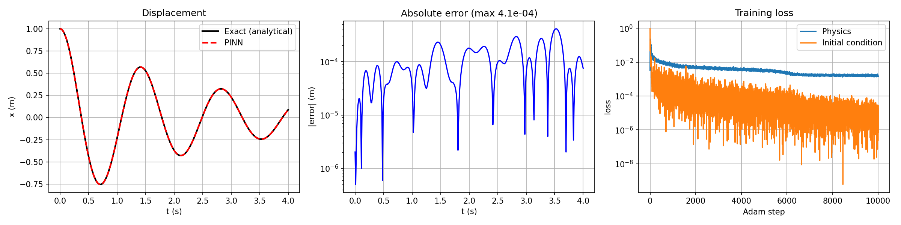
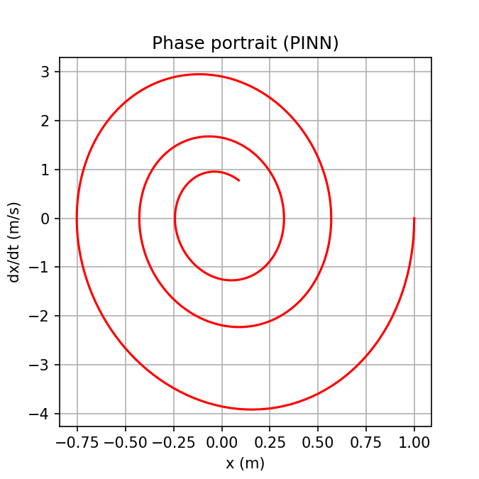

# Spring-Mass-Damper-PINN
A physics-informed neural network (pure PyTorch) that solves m·x'' + c·x' + k·x = 0, x(0)=1, x'(0)=0 with m=1, c=0.8, k=20 (underdamped), using "no measured data", only the equation and initial conditions.

## Method
- Network: MLP, 1 input (t), 3 hidden layers x 48 tanh units, 1 output x(t)
- Derivatives x', x'' via `torch.autograd.grad(create_graph=True)`
- Loss = mean((m·x'' + c·x' + k·x)/k)^2 at 300 random collocation points + (x(0)-1)^2 + (x'(0))^2
- Training: Adam (10k steps, lr 3e-3, exponential decay, fresh points each step), then L-BFGS on a fixed 400-point grid

## Results (seed 0)
| Metric | Value |
|---|---|
| Max abs error vs analytical solution | 4.1e-4 m (~0.04% of amplitude) |
| Final physics residual loss | 8.5e-7 |
| Final IC loss | 2.9e-12 |

## Note:
1. **Trivial solution trap:** x(t)=0 satisfies the ODE, so the IC term must be strong enough (or the residual well scaled). Plain equal weighting collapsed to x≈0.
2. **Normalize the residual** (divide by k) so loss terms are comparable.
3. **Adam then L-BFGS:** Adam gets close; L-BFGS polishes (physics loss 1.5e-3 -> 8.5e-7).
4. **Results vary between runs.** An earlier run of the same recipe ended at 0.049 error when L-BFGS stopped early. Always seed and print final losses.

## Run it
Open the notebook in Google Colab (GPU optional), Runtime → Run all.
